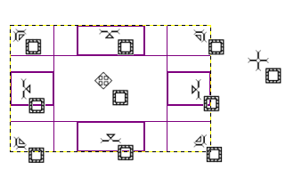

# ResizableRectItem

This little class derives from QGraphicsRectItem and adds the capability to resize.

It implements resizing by handling mouse clicks around the border, while the inner rect is for moving, in the way that GIMP does:

How much of the border is dedicated to resizing can be adjusted by the user. Mouse events that are nearer to the center are passed to the base class implementation so flags like ItemIsMovable still work.

The test project shows a rectangle which can be moved and resized. There is also a child text item, which is used to highlight the fact that child items positions relative to the top-left corner of the rectangle are preserved. Another rectangle is rotated, to show that resizing works correctly even if a transformation matrix is applied.

You can also specify minimum and maximum size, a bit like how a QWidget has them, and the rect item will be constrained by them during resizing. They don't constrain it from programmatic resizes, however.

### Sample usage:

    ResizableRectItem *item = new ResizableRectItem(QRectF(QPointF(10, 20), QPointF(210, 120)),
                                                    15, QSizeF(30, 30), QSizeF(150, 150),
                                                    Qt::DashLine, brush);
    item->setBrush(brush);
    item->setFlag(QGraphicsItem::ItemIsMovable);
    scene->addItem(item);
    item->setPos(100, 100);
